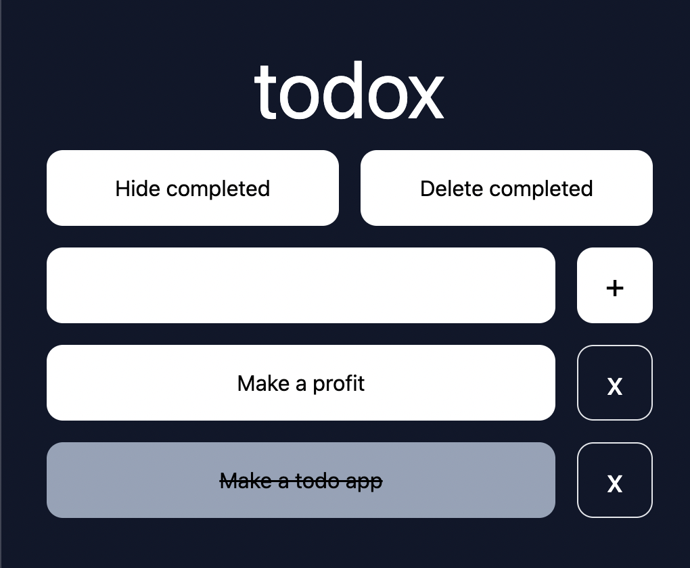

#  todox

A todo application made using a bunch of frameworks containing the letter 'x'.
This is just a toy project; use at your own risk (to productivity).

* [axum](https://github.com/tokio-rs/axum) -- for the HTTP server.
* [htmx](https://github.com/bigskysoftware/htmx) -- to remove the need for
  writing JavaScript.
* [sqlx](https://github.com/launchbadge/sqlx) -- for managing the SQLite
  database, migrations and queries.

I used [maud](https://github.com/lambda-fairy/maud) for templating as it was the
easiest way to just get a string. Unfortunately, no 'x' in the name! (Also
ignoring tokio, tower, serde but they get a pass as being more foundational
libraries)

## Getting started

During development and for database interaction, you need to export the database
URL. Queries are validated while editing the code, pretty nifty!

```sh
export DATABASE_URL=sqlite://db.sqlite
```

You also need to get the database set up before running the server:

```sh
export DATABASE_URL=sqlite://db.sqlite
sqlx database create
sqlx migrate run
```

Then just run the server:

```sh
cargo run
```

## Overall opinion

I quite like htmx. Hyperscript felt a bit out of place; like another web
scripting language to learn, but I understand its value in some places. I don't
think I captured the essence of htmx too well. I'm trusting that the server is
in sync with the front end in some cases, that make it feel more like a
client/server architecture. For example, when I delete a todo, I don't refresh
the list. I just remove that one. I did this in the toggle case because it
flickered otherwise. I think this has to do with incorrect integration of
idiomorph.

On the persistence side of things, sqlx is a blast to use. The automatic
type-casting and validation of queries while still using raw SQL and avoiding
ORM-style abstractions is nothing short of magic. Awesome project.

I haven't fully dived into the power of axum, but I really like the extractor
and `IntoResponse` abstractions. Simple but powerful. I would have to read more
about this framework to fully utilize it. The tower integration is nice. I just
relied on the existing `ServeDir` abstraction, since serving a static file
directory is so common in HTTP web servers.

Maud is dead-simple for templating; it's great.

## Shortcomings

No logging on failure and quite a bit of repetition. The pattern of "SQL did not
change anything therefore return a 4xx or return the response" seems like
something that could be abstracted.

I have not validated where/if/how escaping is required with this setup. My
suspicion is that the bound parameters for queries are escaped and that input is
sanitized via axum by default, but I have not confirmed this.
